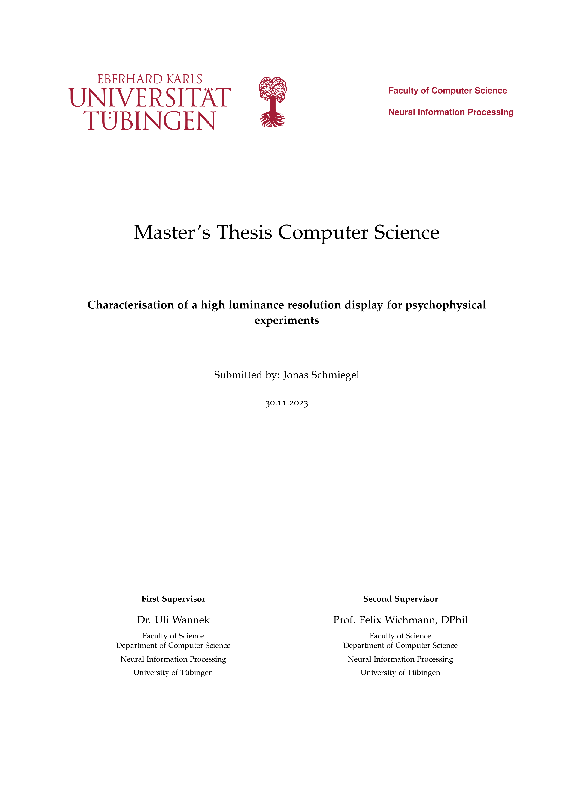

# Characterisation of a high luminance resolution display for psychophysical experiments - Master's Thesis

## Abstract
This thesis focuses on the characterization of high luminance resolution displays, specifically those from VPixx Technologies Inc., which are critical for the accurate representation of visual stimuli in various fields and are used for psychophysical experiments in the NIP research group. The current calibration process suffers from measurement noise and is time-consuming. This necessitates the exploration of a statistical model to improve accuracy and efficiency.

Investigations reveal the significant influence of temperature on luminance values, emphasizing the need for a warm-up period and highlighting unique temperature dependencies among monitor models. The thesis presents a Gaussian process-based model for predicting and mapping luminance behavior that shows promise while also highlighting areas for improvement, particularly in addressing systematic error and saturation.

The proposed model offers a potential shift in current calibration procedures by suggesting a more streamlined approach. By combining temperature measurements with the model, a more efficient calibration process is envisioned, reducing the need for extensive measurements and expediting calibration. 

In conclusion, this thesis provides comprehensive insights into the characterization of high luminance displays and proposes a novel model-driven approach that could revolutionize calibration procedures, enabling more efficient and accurate visual experiments in vision science.

## Repo-Structure
* `./thesis.pdf`: the thesis (main document)
* `./data/*`: data collected and analyzed in the course of this thesis
* `./LICENSE`: license that applies to this repo and the data within
* `./assets`: assets for the README.md